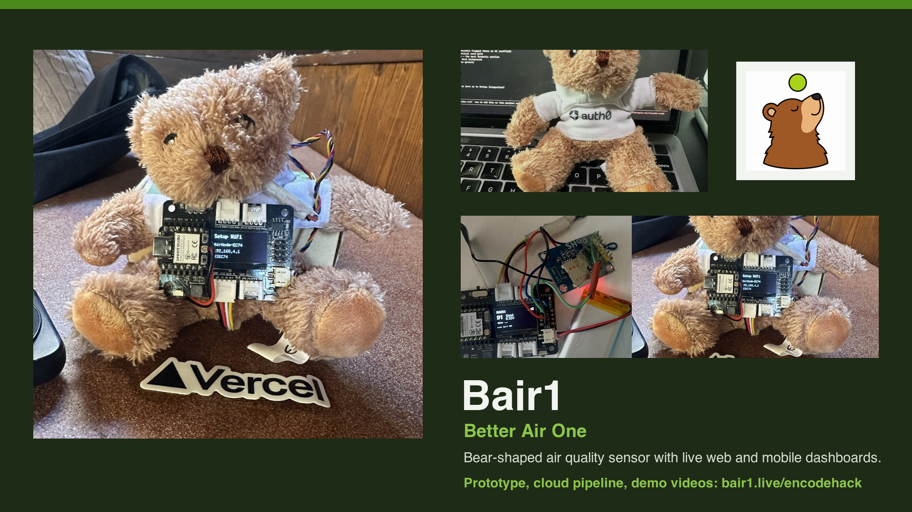

# Bair1 — Better Air One



Consumer air quality monitoring platform: a bear-shaped sensor paired with a web dashboard and mobile app.

The sensor plugs in, connects to WiFi or cellular, and publishes PM1/PM2.5/PM10 readings to [bair1.live](https://bair1.live). One glance at the bear tells you if the air is good.

---

## Monorepo Structure

```
bair1/
├── web/          Next.js 16 — landing page, dashboard, API
├── relay/        Cloudflare Worker — TLS bridge for cellular sensors
├── firmware/     PlatformIO — MG24 Sense + SPS30 particulate sensor
└── mobile/       React Native / Expo — iOS & Android app
```

---

## System Architecture

```
┌─────────────────────────────────────────────────────────────────────────┐
│                           BAIR1 PLATFORM                               │
└─────────────────────────────────────────────────────────────────────────┘

  SENSOR HARDWARE                  CLOUD INFRASTRUCTURE                 CLIENTS
 ┌──────────────┐
 │  MG24 Sense  │
 │  + SPS30     │──┐
 │  + SIM800L   │  │
 │  + OLED      │  │  CELLULAR (2G/GPRS, TLS 1.0)
 └──────────────┘  │
                   │
                   ▼
          ┌─────────────────┐     ┌──────────────────┐     ┌────────────────┐
          │  AWS API Gateway │────▶│  Cloudflare       │────▶│  Vercel         │
          │  (eu-west-2)    │     │  Worker Relay     │     │  Next.js API    │
          │  TLS 1.0 compat │     │  bair1-relay      │     │  /api/readings  │
          └─────────────────┘     └──────────────────┘     └───────┬────────┘
                                                                   │
                                                                   ▼
          ┌────────────────┐      ┌──────────────────┐     ┌────────────────┐
          │  Mobile App    │◀─────│  Auth0           │     │  Neon Postgres  │
          │  (Expo/RN)     │      │  (SPA auth)      │     │  (serverless)   │
          └────────────────┘      └──────────────────┘     └────────────────┘
                                         │
          ┌────────────────┐             │
          │  Web Dashboard │◀────────────┘
          │  bair1.live    │
          └────────────────┘
```

---

## Data Flow

```
 ┌─────────┐    POST JSON     ┌──────────┐   forward +    ┌──────────┐   forward    ┌──────────┐
 │  ESP32  │ ───────────────▶ │  AWS API  │  add headers  │  CF      │ ──────────▶ │  Vercel  │
 │  MG24   │   TLS 1.0       │  Gateway  │ ─────────────▶ │  Relay   │  TLS 1.2    │  API     │
 └─────────┘                  └──────────┘                 └──────────┘             └────┬─────┘
                                                                                        │
     ┌──────────────────────────────────────────────────────────────────────────────────┘
     │  SQL INSERT
     ▼
 ┌──────────┐
 │  Neon    │    SELECT        ┌──────────┐
 │ Postgres │ ◀───────────────│ Dashboard │
 │          │                  │ + Mobile  │
 └──────────┘                  └──────────┘

 Payload:
 {
   "device_id": "64E83383EC74",
   "aqi": 42,
   "pm1": 1.2,
   "pm25": 3.4,
   "pm10": 5.6,
   "gas_raw": 512,
   "gas_voltage": 1.65,
   "rssi": -67,
   "firmware_version": "1.0.0-mg24"
 }
```

---

## Hardware

```
 ┌─────────────────────────────────────────┐
 │            Seeed XIAO MG24 Sense        │
 │                                         │
 │   D4 (SDA) ◀──────── SPS30 white       │
 │   D5 (SCL) ◀──────── SPS30 purple      │
 │   5V       ──────────▶ SPS30 red        │
 │   GND      ──────────▶ SPS30 black/grn  │
 │                                         │
 │   D6 (TX)  ──────────▶ SIM800L RXD     │
 │   D7 (RX)  ◀──────── SIM800L TXD      │
 │                                         │
 │   D4/D5    ──────────▶ SSD1306 OLED    │
 │   D0       ◀──────── MQ Gas (analog)   │
 │   D2       ──────────▶ SD Card CS      │
 └─────────────────────────────────────────┘

 Sensors:
 ┌──────────────┐  PM1, PM2.5, PM10  (I2C)
 │  SPS30       │  Sensirion particulate matter sensor
 └──────────────┘

 ┌──────────────┐  Gas level  (analog ADC)
 │  MQ-series   │  General gas / VOC sensor
 └──────────────┘
```

---

## Services & URLs

| Service | URL | Hosting |
|---------|-----|---------|
| Landing page | [bair1.live](https://bair1.live) | Vercel |
| Dashboard | [bair1.live/dashboard](https://bair1.live/dashboard) | Vercel |
| Sensor relay | bair1-relay.heysalad-o.workers.dev | Cloudflare Workers |
| API Gateway | onzlo0n0eg.execute-api.eu-west-2.amazonaws.com/prod | AWS |
| Database | Neon Postgres (serverless) | Neon |
| Auth | dev-v71n0fw208s2qy8d.us.auth0.com | Auth0 |

---

## Tech Stack

| Layer | Technology |
|-------|-----------|
| Web | Next.js 16, Tailwind v4, TypeScript |
| Mobile | React Native, Expo |
| Relay | Cloudflare Workers |
| Firmware | PlatformIO, C++ (Arduino framework) |
| Database | Neon Postgres (serverless) |
| Auth | Auth0 React SDK v2 |
| Maps | Mapbox GL JS |
| Payments | Stripe |
| TLS Bridge | AWS API Gateway + Lambda |

---

## Quick Start

### Web Dashboard

```bash
cd web
cp .env.example .env.local  # fill in values
npm install
npm run dev
# http://localhost:3000
```

### Cloudflare Relay

```bash
cd relay
npm install
wrangler secret put UPSTREAM_URL
wrangler secret put UPSTREAM_API_KEY
npx wrangler dev
# http://localhost:8787
```

### Firmware

```bash
cd firmware
cp include/config.h.example include/config.h  # fill in values
pip install platformio
pio run -e xiao_esp32c3 -t upload
pio device monitor -b 115200
```

### Mobile App

```bash
cd mobile
npm install
npx expo start
```

---

## AQI States

| State | AQI Range | Bear Expression |
|-------|-----------|-----------------|
| Good | 0-50 | Happy |
| Moderate | 51-100 | Neutral |
| Sensitive | 101-150 | Concerned |
| Unhealthy | 151-200 | Worried |
| Very Unhealthy | 201-300 | Distressed |
| Hazardous | 301+ | Alert |

---

## Design

- **Colors**: Forest Night `#1A2410`, Bair Green `#4A8A1A`, Clean Air `#8DC44A`, Bear Brown `#8C6234`, Fresh Linen `#F2F4F0`
- **Typography**: Space Grotesk (400/500/700)
- **References**: Teenage Engineering, Patagonia, PurpleAir

---

## License

Private — HeySalad Inc.
